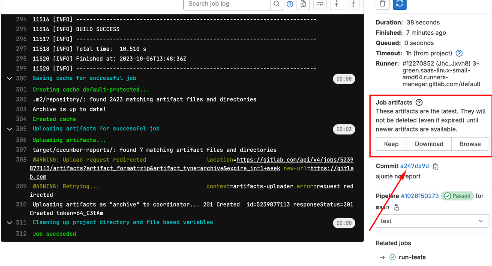

# Suite de Testes de API

Este repositório contém uma suite de testes automatizados para a gestão e autenticação de produtos.

## Pré-requisitos

- Java JDK 8+
- Maven

## Configuração e Execução

### Via linha de comando

1. **Configuração**:

   ```bash
   git clone [URL_DO_REPOSITÓRIO]
   cd [nome_do_diretorio]
   mvn $MAVEN_CLI_OPTS test -Pcob-api-tst
   ```

## Via IDE (por exemplo, IntelliJ IDEA ou Eclipse)
1. **Passos**:

 - Clone o repositório para sua máquina local e importe o projeto como um projeto Maven existente.
 - Após a importação e configuração do projeto, navegue até o diretório de testes e execute os casos de teste diretamente através da IDE.


## GitLab CI
 - Se você tiver o runner do GitLab CI configurado, os testes serão executados automaticamente quando você fizer push para o seu repositório, conforme definido no gitlab-ci.yml.

## Contribuições
 -  Jheymisson Albuquerque


## OBS: O REPORTE DOS TESTES ESTÃO DENTRO NESSE LOCAL.


